## API de Location de Médias (BusterBlock)

## Description
Cette API REST a pour objectif de résoudre la complexité opérationnelle d'un service de location de médias pour la succursale fictive de **BusterBlock**. Elle permet de gérer de manière centralisée et automatisée le catalogue (films et jeux vidéo), les transactions de location, et les différents types d'utilisateurs. L'objectif est d'assurer une gestion plus efficace et d'optimiser l'expérience utilisateur.

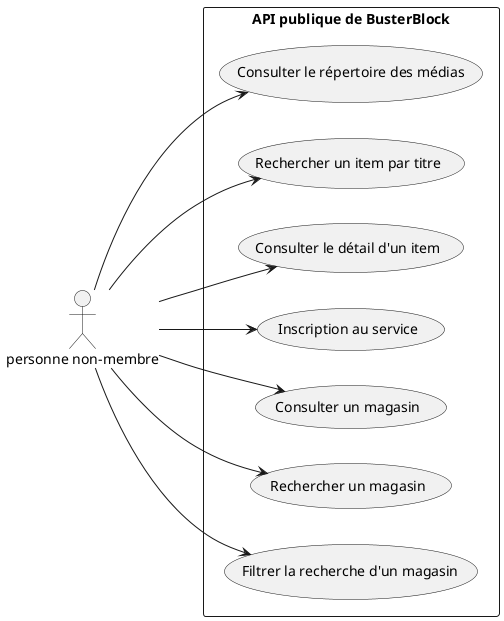

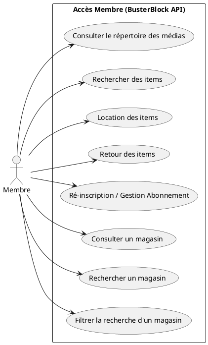

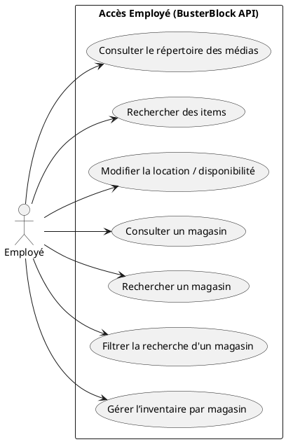

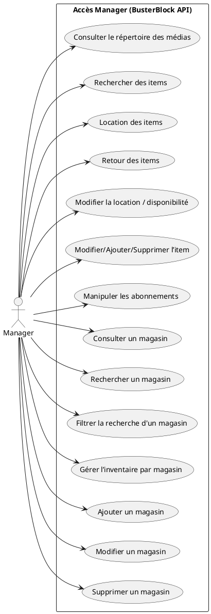

## Installation
Étapes à suivre pour installer l'API sur un serveur.

1. Clone le projet
 
2. Au même niveau que les fichiers Docker, ajouter le fichier .env contenant:
 
MARIADB_HOST=nom de votre service qui crée le conteneur de la bd, dans mon cas db
 
MARIADB_ROOT_PASSWORD=mot de passe de l'utilisateur root
 
MARIADB_DATABASE=nom de votre bd, dans mon cas busterblock_db
 
MARIADB_USER=nom de l'utilisateur, dans ce cas api
 
MARIADB_PASSWORD=mot de passe de l'utilisateur, dans ce cas root
 
MARIADB_PORT=3306
 
DOMAINE=domaine du service d'authentification, dans mon cas api_auth:8090/auth/
 
CLE_PUBLIQUE=adresse du point d'accès sur le serveur d'authentification pour récupérer la clé publique, dans mon cas http://api_auth:8080/auth/.well-known/jwks.json
 
AUDIENCE=identifiant de l'API pour laquelle le service d'authentification est offert, dans mon cas busterblock_api
 
ISSUER=https://api_auth:8090/auth/
 
3. Ajouter aussi un fichier .env-test contenant:
 
MARIADB_HOST=nom de votre service qui crée le conteneur de la bd, dans mon cas db
 
MARIADB_ROOT_PASSWORD=mot de passe de l'utilisateur root
 
MARIADB_DATABASE=nom de la bd de test, dans mon cas busterblock_test
 
MARIADB_USER=nom de l'utilisateur, dans ce cas api
 
MARIADB_PASSWORD=mot de passe de l'utilisateur
 
MARIADB_PORT=3306
 
4. Supprimez les conteneurs et les volumes avec la commande:
 
docker compose down -v
 
5. Recréez et relancez les conteneurs avec la commande:
 
docker compose up --build

## Usage

Le fonctionnement de l'API dépend des droits d'accès de l'utilisateur.

### Droits d'Accès et Authentification

Voici un aperçu des permissions par rôle :

| Acteur | Lecture du Répertoire | Inscription/Ré-inscription | Location/Retour d'Items | Modification Location/Disponibilité | CRUD sur les Médias (Item) | Manipuler Abonnements |
| :--- | :---: | :---: | :---: | :---: | :---: | :---: |
| **Non-Membre** | ✔️ | ✔️ (Inscription) | ❌ | ❌ | ❌ | ❌ |
| **Membre** | ✔️ | ✔️ (Ré-inscription) | ✔️ | ❌ | ❌ | ✔️ (Ré-inscription) |
| **Employé** | ✔️ | ❌ | ❌ | ✔️ | ❌ | ❌ |
| **Manager** | ✔️ | ❌ | ✔️ | ✔️ | ✔️ (Ajout/Modif./Suppr.) | ✔️ |

### Exemples de Requêtes (Simulation)

Voici une simulation des requêtes HTTP pour chaque rôle, utilisant le domaine fictif `https://BusterBlock/api/v1`.

#### Requêtes pour les Non-Membres

| Action | Méthode & Endpoint | Détails |
| :--- | :--- | :--- |
| **Lister tous les médias** | `GET /medias` | Retourne la liste complète du catalogue. |
| **Rechercher un média par titre** | `GET /medias?titre=Comment%Passer%Un%Projet` | Recherche filtrée par mot-clé dans le titre. |
| **Consulter le détail d'un item** | `GET /medias/420` | Retourne les informations complètes d'un média spécifique. |

#### Requêtes pour les Membres

| Action | Méthode & Endpoint | Corps (Body) |
| :--- | :--- | :--- |
| **Emprunter un item** | `POST /locations` | `{ "id_membre": 1, "id_media": 420 }` |
| **Retourner un item** | `PATCH /locations/{id_location}` | `{ "date_retour": "2025-09-23" }` |

#### Requêtes pour les Gestionnaires (Employé / Manager)

| Action | Rôle | Méthode & Endpoint | Corps (Body) |
| :--- | :--- | :--- | :--- |
| **Modifier la disponibilité** | Employé/Manager | `PUT /medias/420` | `{ "disponible": false }` |
| **Ajouter un item** | Manager | `POST /medias` | `{ "titre": "Nouveau Film", "type_media": "film", "genre": "Horreur", "disponible": true }` |
| **Supprimer un item** | Manager | `DELETE /medias/420` | |

---

## Contributeurs

### Collection de Films (Matthew)

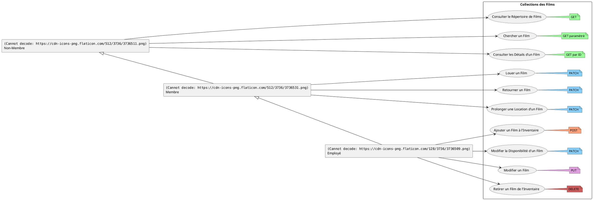

### Collection de Magasins (Base: Matthew | Modification: Lucas)

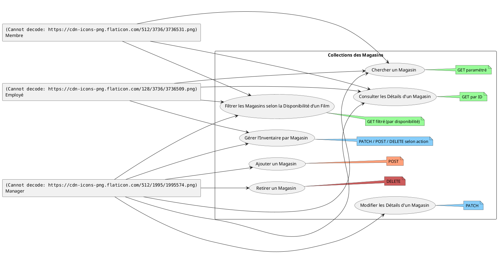

### Diagramme de Classe (Matthew)

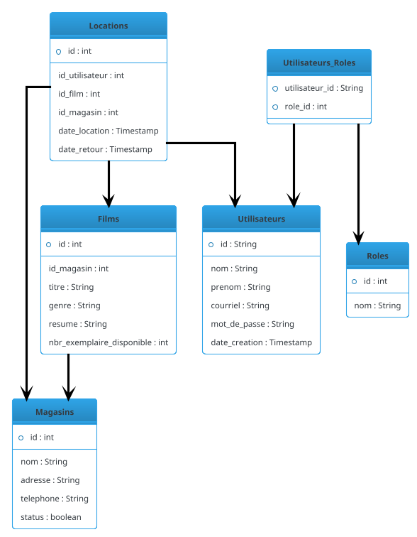

### Modèle Relationnel (Base: Tien | Modification: Matthew)

```plantuml
@startuml
' Config
hide circle
skinparam linetype ortho
!theme cerulean-outline
 
' Entities
entity "**Magasins**" as Mag {
<img:https://emojis.wiki/emoji-pics/facebook/key-facebook.png{scale=0.075}> id: INT
--
<img:https://images.emojiterra.com/twitter/v13.1/512px/1f539.png{scale=0.035}> nom: VARCHAR(255)
<img:https://images.emojiterra.com/twitter/v13.1/512px/1f539.png{scale=0.035}> adresse: VARCHAR(255)
<img:https://images.emojiterra.com/twitter/v13.1/512px/1f539.png{scale=0.035}> telephone: VARCHAR(255)
<img:https://images.emojiterra.com/twitter/v13.1/512px/1f539.png{scale=0.035}> status: BOOLEAN
}

entity "**Films**" as Fil {
<img:https://emojis.wiki/emoji-pics/facebook/key-facebook.png{scale=0.075}> id: INT
--
<img:https://cdn3.emoji.gg/emojis/2756_red_key.png{scale=0.0175}> id_magasin: INT
<img:https://images.emojiterra.com/twitter/v13.1/512px/1f539.png{scale=0.035}> titre: VARCHAR(100)
<img:https://images.emojiterra.com/twitter/v13.1/512px/1f539.png{scale=0.035}> genre: VARCHAR(50)
<img:https://images.emojiterra.com/twitter/v13.1/512px/1f539.png{scale=0.035}> resume: TEXT
<img:https://images.emojiterra.com/twitter/v13.1/512px/1f539.png{scale=0.035}> nbr_exemplaire_disponible: INT
}

entity "**Locations**" as Loc {
<img:https://emojis.wiki/emoji-pics/facebook/key-facebook.png{scale=0.075}> id: INT
--
<img:https://cdn3.emoji.gg/emojis/2756_red_key.png{scale=0.0175}> id_utilisateur: INT
<img:https://cdn3.emoji.gg/emojis/2756_red_key.png{scale=0.0175}> id_film: INT
<img:https://cdn3.emoji.gg/emojis/2756_red_key.png{scale=0.0175}> id_magasin: INT
<img:https://images.emojiterra.com/twitter/v13.1/512px/1f539.png{scale=0.035}> date_location: TIMESTAMP
<img:https://images.emojiterra.com/twitter/v13.1/512px/1f539.png{scale=0.035}> date_retour: TIMESTAMP
}
 
entity "**Utilisateurs**" as Uti {
<img:https://emojis.wiki/emoji-pics/facebook/key-facebook.png{scale=0.075}> id: VARCHAR(255)
--
<img:https://images.emojiterra.com/twitter/v13.1/512px/1f539.png{scale=0.035}> nom: VARCHAR(255)
<img:https://images.emojiterra.com/twitter/v13.1/512px/1f539.png{scale=0.035}> prenom: VARCHAR(255)
<img:https://images.emojiterra.com/twitter/v13.1/512px/1f539.png{scale=0.035}> courriel: VARCHAR(255)
<img:https://images.emojiterra.com/twitter/v13.1/512px/1f539.png{scale=0.035}> mot_de_passe: VARCHAR(255)
<img:https://images.emojiterra.com/twitter/v13.1/512px/1f539.png{scale=0.035}> date_creation: TIMESTAMP
}

entity "**Roles**" as Rol {
<img:https://emojis.wiki/emoji-pics/facebook/key-facebook.png{scale=0.075}> id: INT
--
<img:https://images.emojiterra.com/twitter/v13.1/512px/1f539.png{scale=0.035}> nom: VARCHAR(255)
}

entity "**Utilisateurs_Roles**" as Uti_Rol {
<img:https://emojis.wiki/emoji-pics/facebook/key-facebook.png{scale=0.075}> <img:https://cdn3.emoji.gg/emojis/2756_red_key.png{scale=0.0175}> utilisateur_id: VARCHAR(255)
<img:https://emojis.wiki/emoji-pics/facebook/key-facebook.png{scale=0.075}> <img:https://cdn3.emoji.gg/emojis/2756_red_key.png{scale=0.0175}> role_id: INT
--
}
 
' Liens
Fil |o.[#Black].o| Mag

Uti_Rol }o.[#Black].|| Uti
Uti_Rol }o.[#Black].|| Rol
 
Loc }o.[#Black].|| Fil
Loc }o.[#Black].|| Mag
Loc }o.[#Black].|| Uti
@enduml

```

### Diagramme de Composant d'Architecture (Matthew)

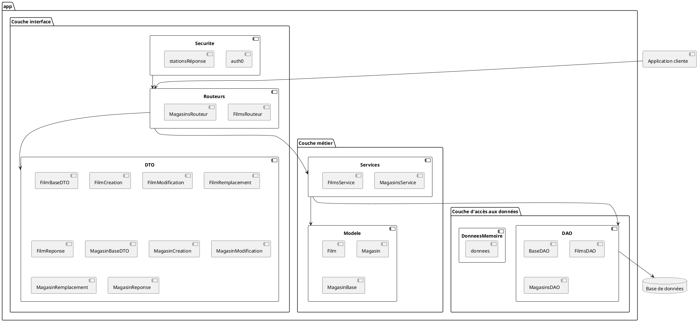

### Retour Item (Tien)

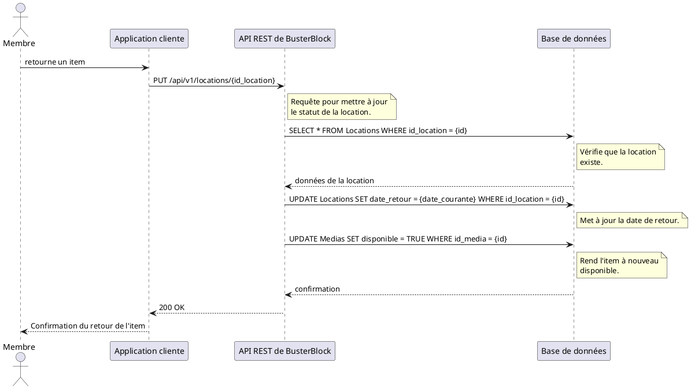

### Recherche des items (Eloge)

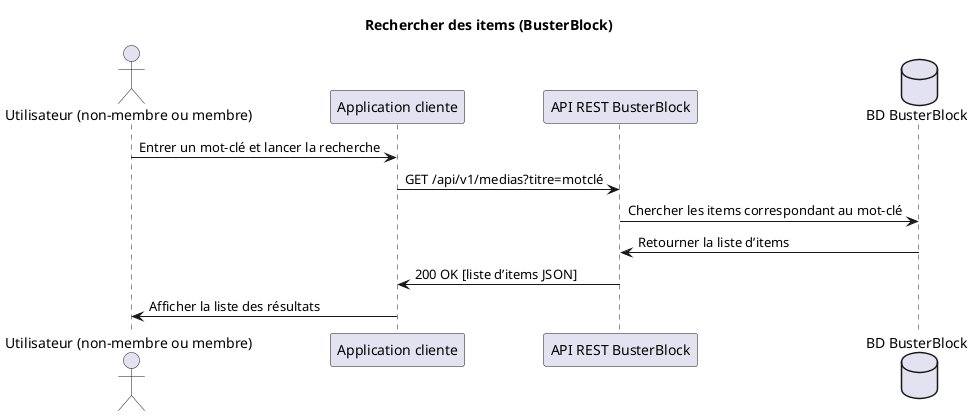

### Recherche des items sans resultats (Eloge)

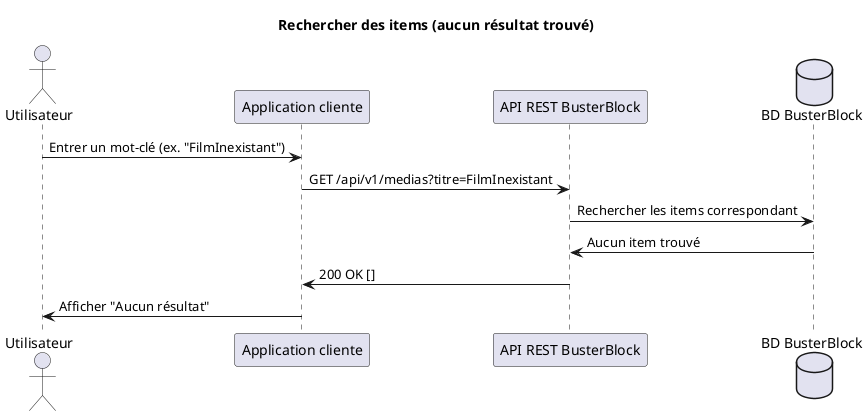

### Description d'un item (Eloge)

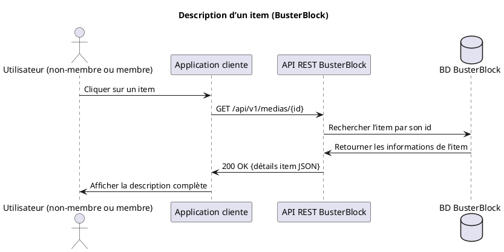

### La répartition des tâches
Le binôme de Lucas et Eloge travaillera sur la partie Magasin de l'API.
 
Et celui de Matthew et Tien travaillera sur la partie Filme de l'API.

## Licence

API de locations de Medias © 2025 by Richard Tien Tran, Lucas Bidault-Meresse, Eloge Assiobo Kossi Mawuli et Matthew Sabourin est distribué sous licence CC BY-NC-SA 4.0.
Pour consulter les détails de la licence, visitez https://creativecommons.org/licenses/by-nc-sa/4.0/
